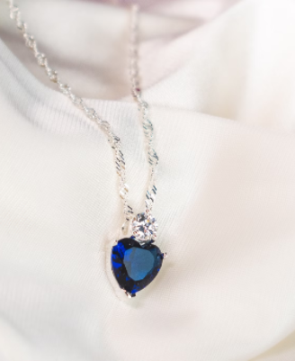

# 💎 Kirti Kunj Jewellers Website

An elegant and fully responsive **jewelry e-commerce landing page**
designed for **Kirti Kunj Jewellers**.\
Built with **HTML, Tailwind CSS, and JavaScript**, this project delivers
a modern shopping experience with a premium aesthetic.

------------------------------------------------------------------------

## ✨ Features

-   🖼️ **Hero Banner** with premium jewelry theme
-   🔍 **Search bar** for quick product access
-   📱 **Mobile-friendly navigation** with hamburger menu & sidebar
-   💍 **Category sections**: Rings, Earrings, Pendants, Necklace,
    Bangles, Mangalsutra, Chains, Gifts
-   🛍️ **Product showcase carousel** with next/prev navigation
-   ❤️ **Wishlist & shopping bag icons**
-   🎨 Styled with **Tailwind CSS** & custom fonts for luxury branding

------------------------------------------------------------------------

## 🛠️ Tech Stack

-   **Frontend:** HTML5, Tailwind CSS, JavaScript (Vanilla)
-   **UI Libraries:** Google Fonts, Swiper.js
-   **Icons:** SVG-based icons for lightweight performance

------------------------------------------------------------------------

## 📂 Project Structure

    .
    ├── index.html      # Main landing page
    ├── script.js       # JavaScript for navigation & product carousel
    ├── assets/         # Images, icons, and logos
    └── README.md       # Project documentation

------------------------------------------------------------------------

## 🚀 Getting Started

### 1. Clone the repository

``` bash
git clone https://github.com/AmanMishra107/jewellery-landing-page.git
cd jewellery-landing-page
```

### 2. Open the project

Simply open `index.html` in your browser.

------------------------------------------------------------------------

## 🌐 Live Demo

🔗 [View Live
Project](https://jewellery-landing-page-six.vercel.app/)

------------------------------------------------------------------------

## 📸 Screenshots

### 🏠 Homepage


### 💍 Product Showcase



------------------------------------------------------------------------

## 🔮 Future Enhancements

-   🛒 Shopping cart functionality
-   👤 User authentication & profile
-   🔎 Product search & filters
-   📦 Backend integration with database (e.g., MongoDB, MySQL)
-   💳 Payment gateway integration

------------------------------------------------------------------------

## 📜 License

You are free to use, modify, and distribute with attribution.

------------------------------------------------------------------------

## 🙌 Acknowledgements

-   [Tailwind CSS](https://tailwindcss.com/)
-   [Swiper.js](https://swiperjs.com/)
-   [Google Fonts](https://fonts.google.com/)
